# Hi, I'm Malak ✦

### Software Engineer · Angular · TypeScript · Full Stack

*where wing meets star — code, curiosity, and cosmos*

 

 

`✦ · · ✦ · ✦ · · ✦ · · ✦ · ✦ · · ✦`

---

## ✦ About Me

I'm a **software engineer** with around 4 years of professional experience building web applications, primarily with **Angular and TypeScript**, alongside full-stack development and backend experience.

I enjoy understanding a system as a whole — from the interface and application architecture to APIs, data, testing, performance, and deployment.

My interests have gradually expanded beyond everyday software development into **security, intelligent systems, computer engineering, and research**.

* 🖥️  Software Engineer at **Beno Technologies**
* 🎓  MSc student · Smart & Secure Computer Engineering Systems
* 🔬  Researcher · security & intelligent systems
* 🌸  Currently learning Japanese
* 🌌  Perpetually curious

---

### ✦ `code` · `build` · `learn` · `explore` ✦

---

## ✦ Tech Stack

### Web & Application Development

### Backend & Data

### Testing & Quality

### SEO, Performance & Analytics

### Infrastructure & Tools

---

## ✦ Selected Work

<table>
<tr>
<td width="50%">

### 🔎 SEO Dashboard

**Angular · TypeScript · Node.js · Technical SEO**

A web-based SEO analysis tool for evaluating pages, metadata, Open Graph data, canonical URLs, accessibility signals, and other technical SEO factors.

[→ Explore the repository](https://github.com/malakh727/seo-dashboard)

</td>

<td width="50%">

### 🛡️ AI Code Security Study

**AI · Security · Research · JavaScript**

A research project investigating vulnerabilities in AI-generated web code through an expanded test-case dataset and security analysis.

[→ Explore the repository](https://github.com/malakh727/ai-code-security-study)

</td>
</tr>

<tr>
<td width="50%">

### 📚 Reading Tracker

**React · Next.js · TypeScript**

A personal reading application exploring modern React development, application state, and user experience.

[→ Explore the repository](https://github.com/malakh727/reading-tracker)

</td>

<td width="50%">

### 🌌 Wing Meets Star

**Astro · Web · Personal Project**

My personal digital space — combining software, writing, curiosity, and the things I keep returning to.

[→ Explore the repository](https://github.com/malakh727/wing-meets-star)

</td>
</tr>
</table>

---

## ✦ Research

### 🔬 Is AI-Generated Web Code Vulnerability-Free?

**Conference Paper · 2026**

Research investigating the security vulnerabilities that can emerge in AI-generated web code and evaluating AI-generated implementations through systematic security analysis.

[→ View the paper on IEEE Xplore](https://ieeexplore.ieee.org/document/11657834)

### 📖 Molecular Physics

**Journal Publication · 2025**

Co-authored research investigating molecular isotopic effects in CO₂, published in *Molecular Physics*.

[→ Read the paper](https://doi.org/10.1080/00268976.2025.2550568)

---

## ✦ MSc

Pursuing an MSc in **Smart & Secure Computer Engineering Systems** at The Hashemite University, expanding my background across computer engineering, cybersecurity, intelligent systems, and research methodology.

---

## ✦ Beyond the Code

### 🌌 Things I Keep Coming Back To

<table>
<tr>
<td align="center" width="25%">

### 🌌

**Astronomy**

Looking up and wondering what's out there.

</td>

<td align="center" width="25%">

### 📖

**Writing**

Stories, ideas, and little worlds.

</td>

<td align="center" width="25%">

### 🌸

**Japanese**

Learning a language, slowly.

</td>

<td align="center" width="25%">

### 🔭

**Exploration**

Following questions wherever they lead.

</td>
</tr>
</table>

 

`✦ ─────────────── ✦`

*I like learning things simply because they make me wonder.*

`✦ ─────────────── ✦`

---

## ✦ Find Me

  

`✦ · · ✦ · ✦ · · ✦`

*building with curiosity, one constellation at a time*

